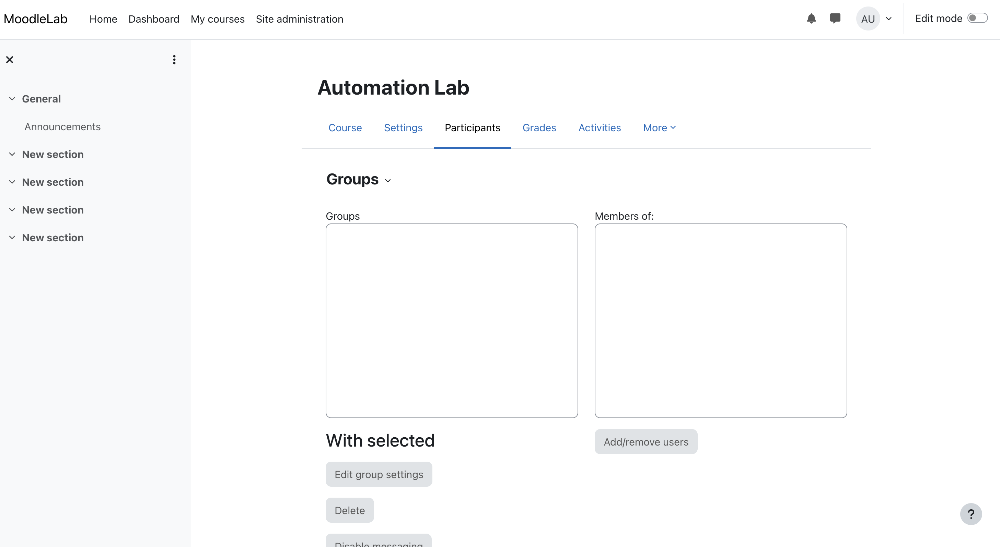
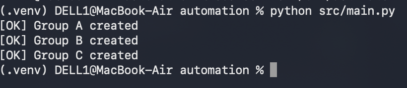
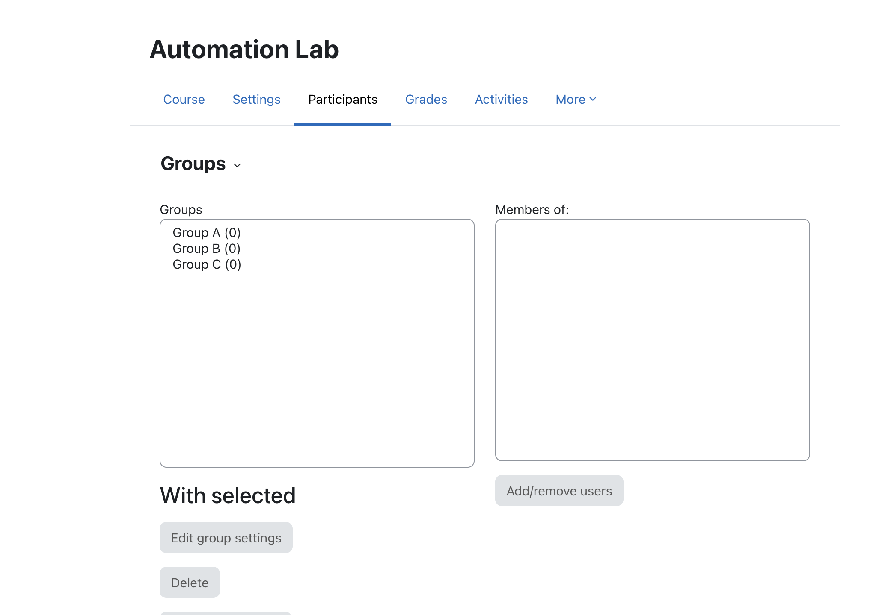
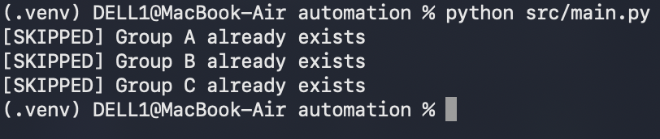

# Project Screenshots

This folder contains real screenshots captured from the local Moodle test environment used to validate the automation.

All screenshots were captured in an isolated local environment using fictional data. No client, learner, production, credential, or confidential information is included.

## 01 — Moodle Groups Before Automation

Shows the Moodle Groups page before running the automation.

This represents the initial state of the test course before the demo groups are created.

## 02 — First Script Execution

Shows the terminal output from the first successful execution of the Python + Playwright automation.

The workflow reads the configured group data and creates the fictional groups in Moodle.

## 03 — Moodle Groups After Automation

Shows the Moodle Groups page after the automation completes successfully.

The fictional groups are now visible in the LMS:

- Group A
- Group B
- Group C

## 04 — Idempotent Second Run

Shows a second execution of the automation.

The script detects that the groups already exist and skips them instead of creating duplicates.

This demonstrates the idempotent behavior of the workflow.
